# Tank Of Battle
 * Link demo game :
## Hướng dẫn cài đặt game 
### [Truy cập vào `**Releases**` để tải game ](https://github.com/dinhkien0701/battle-of-tank/releases)

* BattleOfTank_Setup.exe : Tải game về cài đặt và chơi luôn
* Source.Code.to.Build.App.zip : Phiên bản chứa cả file Setup để cài game kèm mã nguồn đã được thay đổi để có thể tạo ứng dụng hoàn chỉnh
* Battle.Of.Tank.zip : phiên bản mã nguồn gốc của game , chưa tùy biến và có thể chơi 

## Giới thiệu
 Tựa game 2D đơn giản , người chơi sẽ điều khiển xe tăng để tiêu diệt xe tăng địch nhằm đạt điểm cao nhất có thể
 
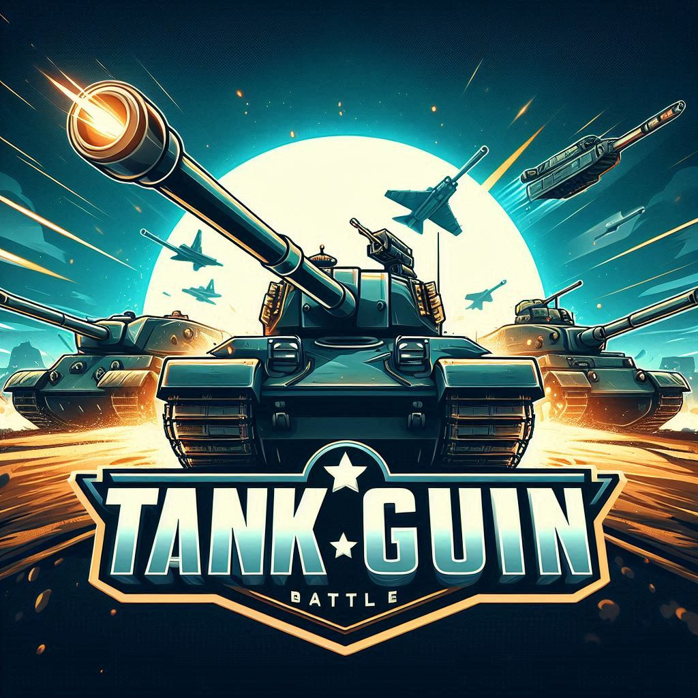

# Hướng dẫn chơi

- [Hướng dẫn chơi game](#Hướng-dẫn-chơi-game)

# Hình ảnh, âm thanh và font chữ

- [Thông tin chi tiết hình ảnh, âm thanh và cả font chữ của game](#Thông-tin-chi-tiết-hình-ảnh-âm-thanh-và-cả-font-chữ-của-game)
  
# Cơ chế của game

- [Đối tượng](#Đối-tượng)
- [Tương tác của đối tượng ](#Tương-tác-của-đối-tượng )
- [Điều khiển](#Điều-khiển)
- [Xây dựng màn chơi](#Xây-dựng-màn-chơi)
- [Simple AI - Xây dựng AI đơn giản cho game](#Simple-AI---Xây-dựng-AI-đơn-giản-cho-game)
---


---
## Hướng dẫn chơi game
* Nhấp chuột nút `play` trên màn hình MENU để chơi game hoặc nhấn các nút `ĐIỂM CAO` hay `HƯỚNG DẪN` để dùng chức năng khác
  
---  
  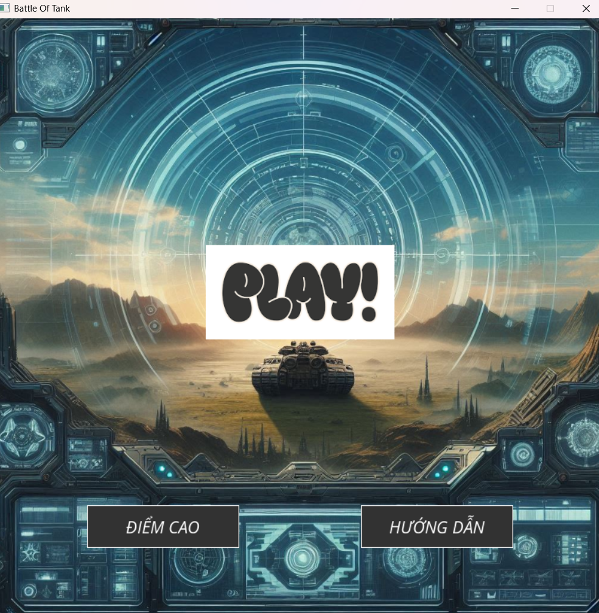

---
  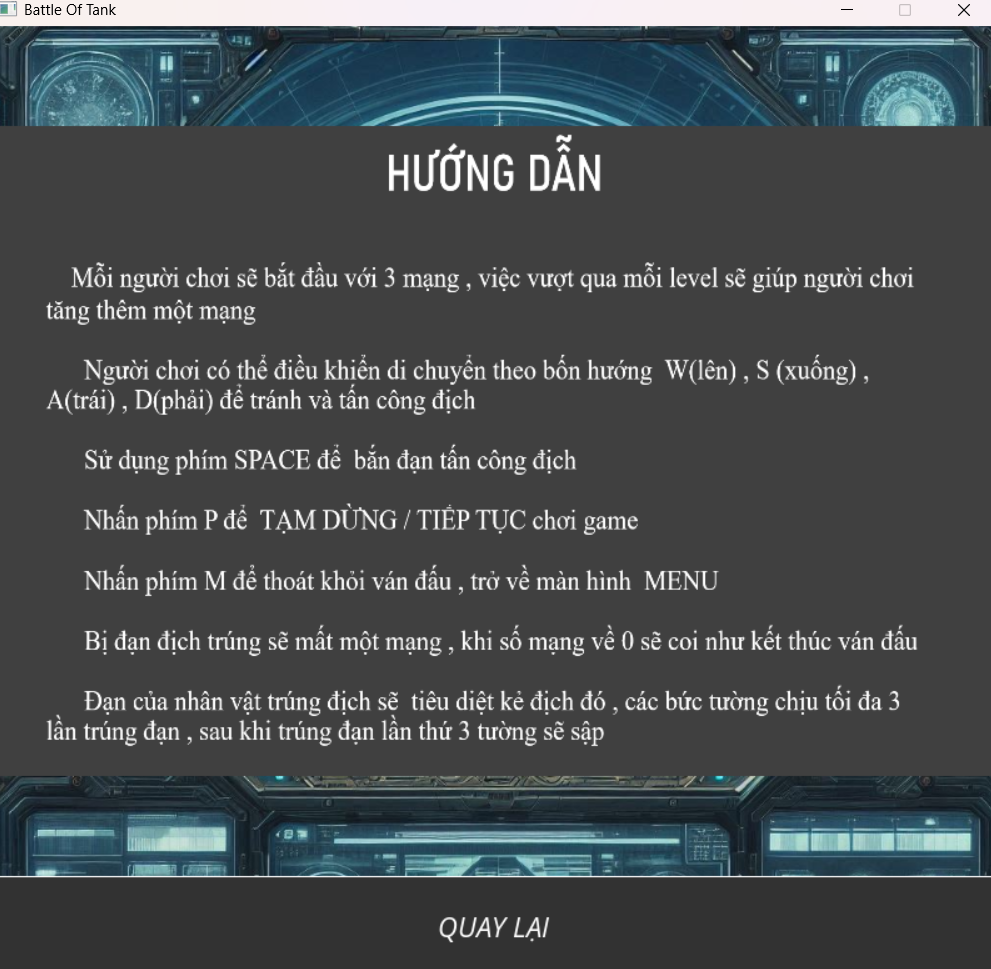

---
  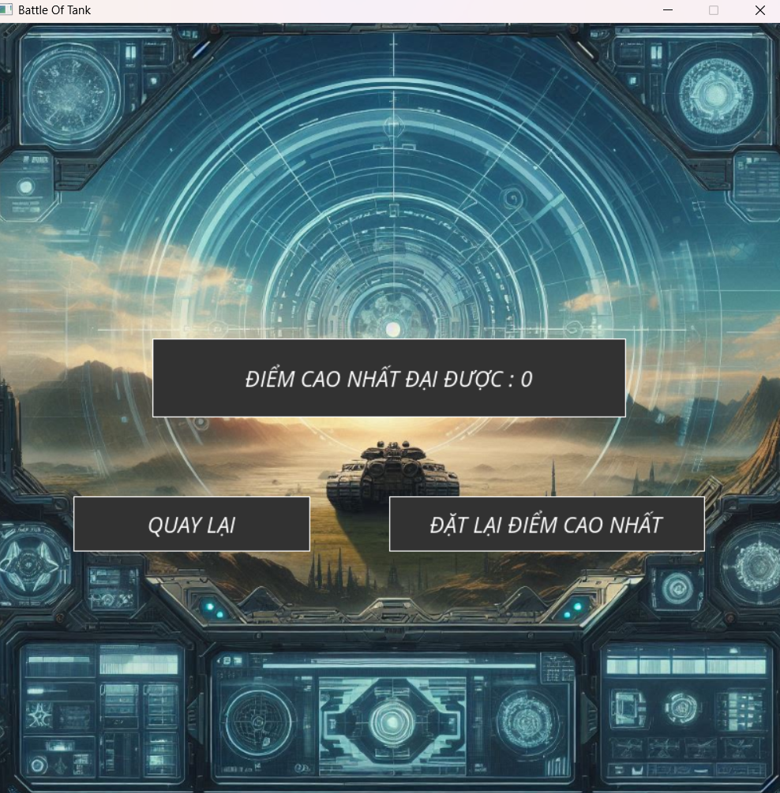

  
* Mỗi người chơi sẽ bắt đầu với 3 mạng , việc vượt qua mỗi level sẽ giúp người chơi  tăng thêm một mạng
* Người chơi có thể điều khiển di chuyển theo bốn hướng  W(lên) , S (xuống) , A(trái) , D(phải) để di chuyển ( có thể dùng phím mũi tên để di chuyển )
* Sử dụng phím SPACE để  bắn đạn tấn công địch
  
    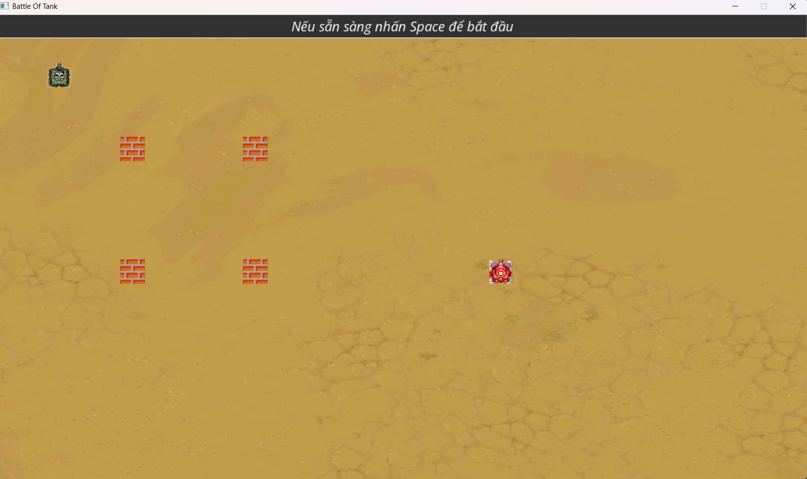
  
  ---
    


* Nhấn phím P để  TẠM DỪNG / TIẾP TỤC chơi game

  ---
   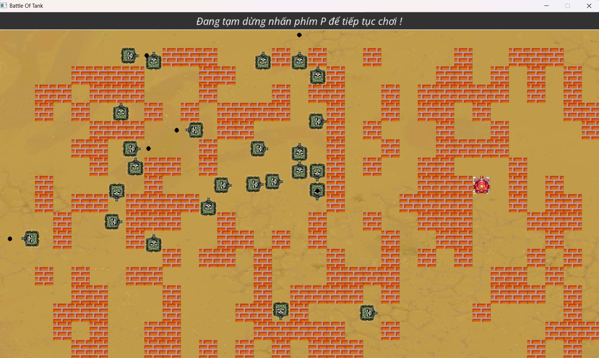

* Nhấn phím M để thoát khỏi ván đấu , trở về màn hình  MENU
 ### Cách thức tấn công
* Bị đạn địch trúng sẽ mất một mạng , khi số mạng về 0 sẽ coi như kết thúc ván đấu
* Đạn của nhân vật trúng địch sẽ  tiêu diệt kẻ địch đó , các bức tường chịu tối đa 3 lần trúng đạn , sau khi trúng đạn lần thứ 3 tường sẽ sập!

  ---
  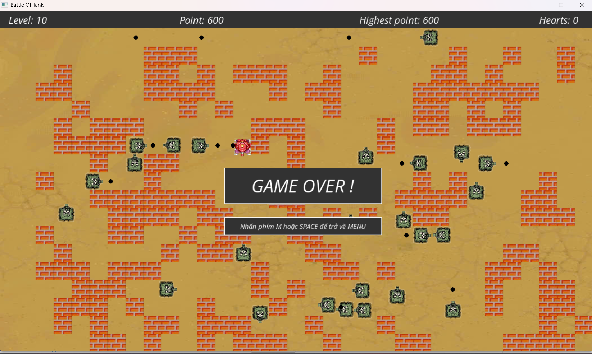
  
---

## Thông tin chi tiết hình ảnh, âm thanh và cả font chữ của game

* Âm thanh tải trên mạng internet : youtube.com và tiengdong.com.
* Hình ảnh cắt từ game , tự vẽ , tải trên mạng và sử dụng AI tạo ảnh.
* Font chữ tải xuống từ Google Font.
### [**File âm thanh của game**](music)
### [**File hình ảnh của game**](image)
### [**File font chữ của game**](font)

### Giới thiệu các hình ảnh đối tượng trong game

 - Hình ảnh xe tăng của người chơi (player / nhân vật )  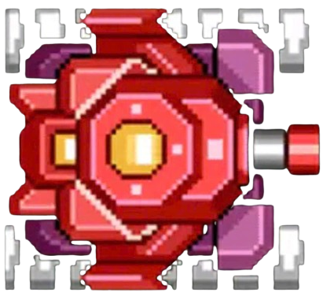   và  đạn tương ứng với xe tăng này là    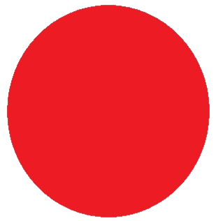


 - Hình ảnh xe tăng của địch ( enemy )  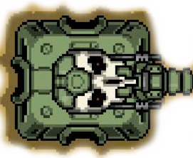   và  đạn tương ứng với xe tăng này là    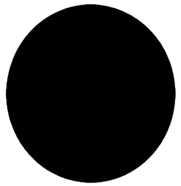
 

 - Hình ảnh bức tường ( wall / vật cản )   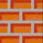

 
---
# Cơ chế của game
---
## Đối tượng
### [Cấu trúc của đối tượng - xem code](https://github.com/dinhkien0701/battle-of-tank/blob/main/source_code/ui/co_che.h#L9-L103)

1. [Nhân vật (Xe tăng người chơi)](https://github.com/dinhkien0701/battle-of-tank/blob/main/source_code/ui/co_che.h#L23-L30)
* Nhân vật trong trò chơi được định danh thông qua id
  
* [attribute = 2] : đây là thuộc tính được khởi tạo để phân biệt nó với các đối tượng khác

* [angle]: Xe tăng luôn bắt đầu ở hướng 270 độ (hướng Bắc), xác định góc mà xe tăng di chuyển hoặc bắn.

* [clock]: Cơ chế bắn của nhân vật tích đủ 15 khung hình (FPS) để thực hiện một lần bắn, mang lại cảm giác hành động liên tục nhưng có kiểm soát.

* [defense]: Giáp bảo vệ, giúp xe tăng chống chịu sát thương.

* [Vị trí (rect)]: Được lưu trữ trong một hình chữ nhật SDL (SDL_Rect), đại diện cho tọa độ và kích thước trên màn hình.

2. [Địch (Xe tăng địch)](https://github.com/dinhkien0701/battle-of-tank/blob/main/source_code/ui/co_che.h#L31-L43) :Đối với xe tăng địch, OBJ thêm vào các hành vi độc đáo và thông minh:

* [attribute = 1] : Định danh đây là một đối tượng địch.

* [rand_shot] : Cơ chế bắn ngẫu nhiên được khởi tạo, với thời gian bắn định kỳ mỗi 2 giây, tạo nên sự bất ngờ và thách thức.

* [Hướng di chuyển - angle ] : Địch được khởi tạo với góc 270 độ và thời gian thay đổi hướng thông qua clock, sinh ngẫu nhiên để đảm bảo hành động linh hoạt.

* [Vị trí (rect)] : Tọa độ và kích thước của địch được định nghĩa giúp dễ dàng hiển thị và kiểm tra va chạm với các đối tượng khác.

3. [Vật cản (Tường)](https://github.com/dinhkien0701/battle-of-tank/blob/main/source_code/ui/co_che.h#L45-L53) :Tường đóng vai trò như chướng ngại vật trong trò chơi

* [attribute = 3]: Thuộc tính xác định đây là tường.

* [defense] : Tường bắt đầu với giáp là 3, yêu cầu người chơi hoặc địch phải phá hủy để di chuyển qua.

* [rect] : Định nghĩa vị trí và kích thước của tường trên màn hình.

* => Vai trò: Tường thêm chiều sâu chiến thuật bằng cách cản trở di chuyển của các đối tượng.

4. [Đạn](https://github.com/dinhkien0701/battle-of-tank/blob/main/source_code/ui/co_che.h#L54-L79)  ( Đạn được sinh ra từ cả nhân vật và địch để tạo ra hành động )

* [rect]  : Kích thước nhỏ gọn (10x10) và tọa độ khởi tạo dựa trên vị trí và góc của đối tượng bắn.

* [angle] : Hướng của viên đạn phụ thuộc hoàn toàn vào góc bắn của đối tượng tạo ra nó.

* [attribute] : Loại đạn được liên kết với loại đối tượng (ví dụ: đạn của địch khác với đạn của người chơi) .

5. [Các chức năng hỗ trợ](https://github.com/dinhkien0701/battle-of-tank/blob/main/source_code/ui/co_che.h#L81-L103)
   
* `xoa_obj()` : Xóa đối tượng khỏi trò chơi bằng cách đặt id = -1, biểu thị rằng đối tượng đã bị loại bỏ ( gần như không dùng :]] )

* `tiep_xuc()` : Kiểm tra va chạm giữa hai đối tượng, từ xe tăng chạm vào tường cho đến đạn chạm vào địch.

* `print_obj()` : Hiển thị đối tượng lên màn hình với góc xoay và vị trí chính xác.

### [Khởi tạo bản đồ đối tượng - xem code](https://github.com/dinhkien0701/battle-of-tank/blob/main/source_code/ui/co_che.cpp#L34-L141)

#### Xây dựng bản đồ ban đầu:
[Hàm `map_khoi_dong`](https://github.com/dinhkien0701/battle-of-tank/blob/main/source_code/ui/co_che.cpp#L51-L139) đảm nhận việc tạo ra một bản đồ gồm các đối tượng như nhân vật chính, địch, và tường. Mỗi đối tượng được định vị theo level hiện tại, giúp game tăng độ khó theo thời gian. 

**Các bước tạo bản đồ bao gồm trong hàm `map_khoi_dong` :**
- **Cấp thấp (Level < 3):** Vị trí nhân vật chính và địch được định nghĩa cụ thể. Tường được đặt tại các vị trí cố định, dễ dàng cho người chơi làm quen.
- **Cấp độ cao (Level ≥ 4):** Vị trí nhân vật chính và địch được sinh ngẫu nhiên, đảm bảo sự đa dạng. Tường được khởi tạo với số lượng tăng theo level, tối đa 260 bức tường và tối đa 30 kẻ địch.
- **Game coi như một game vô hạn cấp độ mục tiêu tiêu diệt càng nhiều càng tốt xe tăng địch**
  
#### **[Hàm `dfs_map` - Sinh các bức tường ngẫu nhiên](https://github.com/dinhkien0701/battle-of-tank/blob/main/source_code/ui/co_che.cpp#L38-L50)**

Hàm `dfs_map` đảm nhận nhiệm vụ sinh các bức tường trong bản đồ một cách ngẫu nhiên, đảm bảo mỗi màn chơi đều mang lại sự mới mẻ và thử thách. Dưới đây là chi tiết từng bước hoạt động của hàm:

1. **Đánh dấu ô hiện tại là tường:**
   - Khi hàm được gọi tại vị trí `(i, j)`, ô đó sẽ được đánh dấu là tường:
     ```cpp
     map_of_level[i][j] = 1; // Đánh dấu ô hiện tại là tường (1).
     ```

2. **Sinh số nhánh mở rộng ngẫu nhiên:**
   - Hàm sinh từ 1 đến 3 nhánh ngẫu nhiên từ ô hiện tại, sử dụng công thức:
     ```cpp
     for (int num = rand() % 3 + 1; num > 0; num--) { ... }
     ```

3. **Kiểm tra điều kiện mở rộng:**
   - Các điều kiện sau giúp kiểm soát logic mở rộng:
     - **`res == 2`:** Giới hạn số nhánh tối đa từ mỗi ô là 2, tránh tạo cấu trúc tường quá phức tạp.
     - **`total >= max_total`:** Ngừng tạo tường nếu tổng số đã đạt giới hạn tối đa.

4. **Sinh bước dịch chuyển ngẫu nhiên:**
   - Dịch chuyển sang các ô gần kề theo tọa độ `(x, y)` ngẫu nhiên:
     ```cpp
     int x = rand() % 2 - rand() % 2; // Dịch chuyển theo trục x (-1, 0, 1).
     int y = rand() % 2 - rand() % 2; // Dịch chuyển theo trục y (-1, 0, 1).
     ```

5. **Kiểm tra hợp lệ:**
   - Nếu ô mới nằm ngoài biên hoặc đã có tường, bỏ qua:
     ```cpp
     if (x < 0 || x > 32 || y < 1 || y > 18 || map_of_level[i + x][j + y]) continue;
     ```

6. **Gọi đệ quy:**
   - Nếu hợp lệ, hàm được gọi lại để mở rộng cấu trúc tường:
     ```cpp
     dfs_map(i + x, j + y, map_of_level, ++total, max_total);
     ```

---

#### **Logic kiểm tra khoảng cách:**

Trong hàm `map_khoi_dong`, logic kiểm tra khoảng cách giữa nhân vật chính và địch được triển khai như sau:

```cpp
while (mapp[x][y] > 0 || sqrt((cx - x) * (cx - x) + (cy - y) * (cy - y)) < 9);
```
---
#### [Gán đối tượng vào bản đồ:](https://github.com/dinhkien0701/battle-of-tank/blob/main/source_code/ui/co_che.cpp#L109-L139)
Sau khi bản đồ được tạo, các đối tượng (nhân vật, địch, và tường) được khởi tạo và thêm vào danh sách đối tượng tương ứng (`make_enemy`, `make_obj`). Điều này giúp dễ dàng quản lý và hiển thị các đối tượng trong màn chơi.

#### Vai trò và cơ chế nâng cấp:
- **Nhân vật chính:** Luôn khởi đầu với góc 270 độ và được thưởng thêm mạng mỗi level.
- **Địch:** Tăng số lượng và hành vi linh hoạt khi level cao.
- **Tường:** Số lượng tường tăng theo level, đòi hỏi người chơi phải phá hủy để mở đường di chuyển.

#### Điểm nổi bật của cơ chế khởi tạo:
- **Sự ngẫu nhiên:** Mỗi màn chơi mang lại trải nghiệm mới, không lặp lại, giúp người chơi không nhàm chán.
- **Chiến thuật:** Tường được đặt thông minh để tạo thử thách, kết hợp với vị trí kẻ địch để người chơi phải suy nghĩ kỹ trước khi hành động.
- **Hiệu quả:** Cách tổ chức mã nguồn giúp quản lý đối tượng dễ dàng, mở rộng logic cho các cấp độ khó hơn.

## Tương tác của đối tượng 

#### **[1. Hàm `kiem_tra_va_cham`](https://github.com/dinhkien0701/battle-of-tank/blob/main/source_code/ui/act.cpp#L172-L199)**

Hàm này kiểm tra va chạm của một đối tượng `obj` với các đối tượng khác như nhân vật chính, kẻ địch, và tường trong bản đồ. Đây là logic quan trọng để đảm bảo các hành động trong game diễn ra chính xác.

**Cách hoạt động:**
1.1. **Kiểm tra giới hạn màn hình:**
   - Nếu đối tượng `obj` vượt ra khỏi giới hạn màn hình, hàm sẽ trả về `true` (đã va chạm).
     ```cpp
     if(x<0 || x+w>1320 || y<40 || y+h>760) {
         return true;
     }
     ```

1.2. **Chuyển đổi tọa độ sang lưới bản đồ:**
   - Tọa độ của đối tượng được quy đổi sang ô lưới (`40x40`) trên bản đồ.
     ```cpp
     w = (x + w - 1) / 40;
     h = (y + h - 1) / 40;
     x /= 40; 
     y /= 40;
     ```

1.3. **Kiểm tra va chạm với tường:**
   - Nếu bất kỳ ô nào trong lưới có giá trị `< 0` (tường), hàm trả về `true`.
     ```cpp
     if(bfs_map[x][y] < 0 || bfs_map[x][h] < 0 || bfs_map[w][y] < 0 || bfs_map[w][h] < 0) {
         return true;
     }
     ```

1.4. **Kiểm tra va chạm với nhân vật chính:**
   - Nếu `obj` không phải nhân vật chính, hàm kiểm tra va chạm trực tiếp bằng `tiep_xuc`.
     ```cpp
     if(obj.id != player.id) {
         if(obj.tiep_xuc(player)) return true;
     }
     ```

1.5. **Kiểm tra va chạm với kẻ địch:**
   - Duyệt qua danh sách kẻ địch (`enemy_list`) để kiểm tra va chạm. Nếu `obj` chạm vào bất kỳ kẻ địch nào (trừ đối tượng đã bị loại bỏ `id = -1`), hàm trả về `true`.

#### **[2. Hàm `kiem_tra_duong_dan`:](https://github.com/dinhkien0701/battle-of-tank/blob/main/source_code/ui/act.cpp#L340-L385)**

Hàm này kiểm tra đường đi của một đối tượng `obj` như đạn, bao gồm va chạm với tường, nhân vật chính, hoặc kẻ địch.

**Cách hoạt động:**
2.1. **Kiểm tra giới hạn màn hình:**
   - Tương tự như hàm `kiem_tra_va_cham`, nếu đối tượng vượt khỏi giới hạn, trả về `true`.
     ```cpp
     if(x<0 || x+w>1320 || y<40 || y+h>760) {
         return true;
     }
     ```

2.2. **Kiểm tra va chạm với tường:**
   - Giảm `defense` của tường khi đạn va chạm vào. Nếu `defense` giảm về 0, tường sẽ bị phá hủy.
     ```cpp
     if(wall_map[x][y] > 0) {
         ans = true;
         wall_list[wall_map[x][y]].defense -= 1;
     }
     ```

2.3. **Kiểm tra va chạm với nhân vật chính:**
   - Nếu đạn không cùng thuộc tính với nhân vật chính và xảy ra va chạm, `defense` của nhân vật giảm đi 1.
     ```cpp
     if(obj.attribute != player.attribute) {
         if(obj.tiep_xuc(player)) {
             ans = true;
             player.defense -= 1;
         }
     }
     ```

2.4. **Kiểm tra va chạm với kẻ địch:**
   - Nếu đạn chạm vào kẻ địch có thuộc tính khác, kẻ địch sẽ bị xóa (`id = -2`) và trả về `true`.
     ```cpp
     if((enemy_list[i].attribute != obj.attribute) && obj.tiep_xuc(enemy_list[i])) {
         enemy_list[i].id = -2;
         ans = true;
     }
     ```

#### **[3. Hàm `cham_tuong`:](https://github.com/dinhkien0701/battle-of-tank/blob/main/source_code/ui/act.cpp#L387-L389)**

Hàm kiểm tra xem một tọa độ `(x, y)` có chạm phải tường trong bản đồ BFS (`bfs_map`) hay không.

**Cách hoạt động:**
**Kiểm tra giá trị BFS:**
   - Nếu giá trị tại vị trí `(x / 40, y / 40)` nhỏ hơn `0`, hàm trả về `true` (đã chạm tường).
     ```cpp
     return bfs_map[x / 40][y / 40] < 0;
     ```

---

### **Ý nghĩa và vai trò của các hàm:**

1. **`kiem_tra_va_cham`:**
   - Đảm bảo các đối tượng trong game không vượt giới hạn hoặc va chạm không mong muốn. 
   - Quản lý trạng thái của đối tượng, ví dụ như loại bỏ địch khi có va chạm.

2. **`kiem_tra_duong_dan`:**
   - Làm rõ cách các vật thể di chuyển và tương tác (đạn, tường, nhân vật). 
   - Tạo cơ chế phá hủy tường và giảm mạng khi bị bắn trúng.

3. **`cham_tuong`:**
   - Cung cấp một cách kiểm tra nhanh để xác định xem đối tượng có thể di chuyển vào một vị trí cụ thể hay không.

Những hàm này là nền tảng cho cơ chế chiến đấu và tương tác trong **Tank Of Battle**, mang lại sự phức tạp và tính chiến thuật cao cho trò chơi 🚀🎮✨


## Điều khiển

### **[Hàm kiểm tra Event (thao tác điều khiển đơn giản)](https://github.com/dinhkien0701/battle-of-tank/blob/main/source_code/ui/act.cpp#L109-L166)**

Hàm `handleEvent` chịu trách nhiệm xử lý các thao tác điều khiển trong trò chơi. Từ việc di chuyển nhân vật đến bắn đạn và tạm dừng, hàm này đảm bảo mỗi hành động của người chơi được phản hồi đúng cách.

#### **Chi tiết hàm `handleEvent`:**

1. **Xử lý sự kiện đóng cửa sổ:**
   - Nhận yêu cầu đóng cửa sổ từ người chơi bằng cách lắng nghe `SDL_QUIT`.
     ```cpp
     case SDL_QUIT:
         exit(0);
         break;
     ```

2. **Xử lý sự kiện phím bấm:**
   - Phím bấm điều khiển nhân vật:
     - W / mũi tên lên: Di chuyển lên.
     - S / mũi tên xuống: Di chuyển xuống.
     - A / mũi tên trái: Di chuyển sang trái.
     - D / mũi tên phải: Di chuyển sang phải.
     ```cpp
     case SDLK_w:
         upy++;
         break;
     case SDLK_s:
         upy--;
         break;
     case SDLK_a:
         upx--;
         break;
     case SDLK_d:
         upx++;
         break;
     ```

   - SPACE: Bắn đạn.
   - P: Tạm dừng hoặc tiếp tục trò chơi.
   - M: Thoát màn chơi, trở về menu.
     ```cpp
     case SDLK_SPACE:
         ban_dan = true;
         break;
     case SDLK_p:
         pause = (!pause);
         break;
     case SDLK_m:
         back_to_menu = true;
         break;
     ```

3. **Xử lý sự kiện chuột:**
   - Kiểm tra nếu chuột trái được nhấn để lấy vị trí `(x, y)` của điểm bấm.
     ```cpp
     case SDL_MOUSEBUTTONDOWN:
         if(event.button.button == SDL_BUTTON_LEFT) {
             mouse_left.first = event.button.x;
             mouse_left.second = event.button.y;
         }
         break;
     ```

---

### **Hàm điều khiển của người chơi**

Hàm `lua_chon` được thiết kế để xử lý hành vi di chuyển của nhân vật chính (xe tăng người chơi) trong trò chơi, bao gồm việc thay đổi hướng và xử lý va chạm.

#### **[Chi tiết hàm `lua_chon`:](https://github.com/dinhkien0701/battle-of-tank/blob/main/source_code/ui/act.cpp#L391-L475)**

1. **Xác định hướng di chuyển:**
   - Dựa trên giá trị của `upx` (di chuyển ngang) và `upy` (di chuyển dọc), hướng di chuyển của nhân vật được xác định:
     ```cpp
     if(abs(upx) >= abs(upy)) {
         if(upx > 0) player.angle = 0;
         else if(upx < 0) player.angle = 180;
     } else {
         if(upy > 0) player.angle = 270;
         else if(upy < 0) player.angle = 90;
     }
     ```

2. **Kiểm tra va chạm trước khi di chuyển:**
   - Tạo đối tượng thử nghiệm `player_test` để kiểm tra khả năng di chuyển vào vị trí mới:
     ```cpp
     new_obj_location(player_test.rect, player_test.angle, 4);
     if(kiem_tra_va_cham(player_test, player_test, enemy_list, total_enemy, bfs_map) == false) {
         player = player_test;
     }
     ```

3. **Cơ chế trượt tường:**
   - Nếu va chạm với tường, nhân vật sẽ "trượt" lên hoặc xuống để tránh đứng yên:
     ```cpp
     if(cham_tuong(w, y, bfs_map) ^ cham_tuong(w, h, bfs_map)) {
         OBJ T1 = player;
         OBJ T2 = player;
         T1.rect.y -= 2;
         T2.rect.y += 2;
         if(cham_tuong(w, y, bfs_map) == false && kiem_tra_va_cham(T1, T1, enemy_list, total_enemy, bfs_map) == false) {
             player = T1;
         } else if(cham_tuong(w, h, bfs_map) == false && kiem_tra_va_cham(T2, T2, enemy_list, total_enemy, bfs_map) == false) {
             player = T2;
         }
     }
     ```

4. **Đặt lại trạng thái di chuyển:**
   - Sau khi xử lý, giá trị `upx` và `upy` được đặt lại về 0:
     ```cpp
     upx = upy = 0;
     ```

---

### **Giới thiệu chung về hàm phản hồi điều khiển**

- **`handleEvent`:** Đảm bảo mọi thao tác của người chơi (phím bấm, chuột) đều được phản hồi chính xác.
- **`lua_chon`:** Tinh chỉnh di chuyển của nhân vật, đặc biệt là cơ chế trượt tường, tạo trải nghiệm di chuyển mượt mà và hợp lý.

---

### **Giải thích cơ chế mới đáng chú ý**

#### **[Cơ chế trượt tường](https://github.com/dinhkien0701/battle-of-tank/blob/main/source_code/ui/act.cpp#L407-L472)**

Do kích thước mỗi ô pixel trong bản đồ là **40x40**, khi nhân vật chỉ va chạm nhẹ (1 pixel) vào tường, việc di chuyển sẽ bị ngăn lại, gây ra hiện tượng "đứng yên" không mong muốn mà mắt thường khó nhận biết. Để khắc phục vấn đề này, trò chơi đã tích hợp một **cơ chế trượt tường**, giúp nhân vật có thể linh hoạt điều chỉnh vị trí và tiếp tục di chuyển mà không bị kẹt.

---

### **Chi tiết hoạt động**

1. **Xác định vị trí va chạm:**
   - Trò chơi sử dụng các tọa độ của nhân vật (`x`, `y`, `w`, `h`) để xác định xem có va chạm với cạnh của tường hay không. Logic sử dụng phép XOR (`^`) để kiểm tra nếu **chỉ một cạnh va chạm**, cơ chế trượt sẽ được kích hoạt:
     ```cpp
     if(cham_tuong(w, y, bfs_map) ^ cham_tuong(w, h, bfs_map)) {
         ...
     }
     ```

2. **Tạo chuyển động trượt:**
   - Khi va chạm được phát hiện, nhân vật sẽ được thử di chuyển lên hoặc xuống (hoặc trái hoặc phải tùy theo hướng va chạm). Hai đối tượng tạm thời `T1` và `T2` được tạo ra để kiểm tra vị trí mới:
     ```cpp
     OBJ T1 = player;
     OBJ T2 = player;
     T1.rect.y -= 2; // Thử di chuyển lên.
     T2.rect.y += 2; // Thử di chuyển xuống.
     ```

3. **Kiểm tra tính hợp lệ của vị trí mới:**
   - Mỗi vị trí mới (`T1` và `T2`) được kiểm tra bằng hàm `cham_tuong` và `kiem_tra_va_cham`. Nếu hợp lệ (không chạm tường hoặc đối tượng khác), nhân vật sẽ được chuyển đến vị trí đó:
     ```cpp
     if(cham_tuong(w, y, bfs_map) == false && kiem_tra_va_cham(T1, T1, enemy_list, total_enemy, bfs_map) == false) {
         player = T1; // Trượt lên.
     } else if(cham_tuong(w, h, bfs_map) == false && kiem_tra_va_cham(T2, T2, enemy_list, total_enemy, bfs_map) == false) {
         player = T2; // Trượt xuống.
     }
     ```

4. **Đồng nhất trên mọi hướng:**
   - Cơ chế trượt tương tự cũng được áp dụng khi nhân vật di chuyển **trái**, **phải**, hoặc theo chiều dọc.

---

### **Ý nghĩa và tác động trong trò chơi**

- **Mượt mà hơn:**
  - Người chơi không gặp tình trạng nhân vật "đứng yên" khi chạm cạnh tường, mang lại cảm giác điều khiển mượt mà và tự nhiên.

- **Hợp lý về vật lý:**
  - Cơ chế mô phỏng cách các vật thể trong thế giới thực có xu hướng "lướt" qua các góc cạnh thay vì bị kẹt hoàn toàn.

- **Cải thiện trải nghiệm:**
  - Người chơi cảm nhận rõ sự tinh tế trong thiết kế điều khiển, giúp tăng cường sự thỏa mãn khi tham gia trò chơi.

---

### **Ví dụ minh họa từ mã nguồn**

Dưới đây là đoạn mã minh họa việc kiểm tra và xử lý cơ chế trượt tường khi nhân vật di chuyển sang phải:

```cpp
if(player.angle == 0) { // Hướng di chuyển sang phải.
    if(cham_tuong(w, y, bfs_map) ^ cham_tuong(w, h, bfs_map)) {
        OBJ T1 = player; // Trường hợp trượt lên.
        OBJ T2 = player; // Trường hợp trượt xuống.
        T1.rect.y -= 2;
        T2.rect.y += 2;

        if(cham_tuong(w, y, bfs_map) == false && kiem_tra_va_cham(T1, T1, enemy_list, total_enemy, bfs_map) == false) {
            player = T1;
        } else if(cham_tuong(w, h, bfs_map) == false && kiem_tra_va_cham(T2, T2, enemy_list, total_enemy, bfs_map) == false) {
            player = T2;
        }
    }
}
```

---


## Xây dựng màn chơi

### 1. Mô hình màn chơi
#### [Xem chi tiết ở source_code/ui/play.cpp](https://github.com/dinhkien0701/battle-of-tank/blob/main/source_code/ui/play.cpp)

Hàm `run_game` chịu trách nhiệm điều khiển toàn bộ logic của màn chơi, từ khởi tạo đến kết thúc. Các thành phần chính bao gồm:

- **Khởi tạo màn chơi:**  
  + Tải các tài nguyên như hình ảnh (nền, xe tăng của người chơi, địch, tường, đạn) và chuyển đổi chúng thành `SDL_Texture` để vẽ lên màn hình.  
  + Mở font chữ dùng cho HUD và banner.  
  + Đặt cửa sổ game với kích thước cố định **1320x760** và căn giữa màn hình.  
  + Khởi tạo các mảng lưu trữ trạng thái của tường và đường đi, ví dụ như `wall_map[45][25]` và `bfs_map[45][25]`.

- **Xử lý sự kiện:**  
  + Sử dụng `handleEvent` để nhận các thao tác từ người chơi như di chuyển (W, A, S, D hoặc mũi tên), bắn đạn (SPACE), tạm dừng (P) hay thoát (/quay lại menu bằng M).

- **Cập nhật trạng thái:**  
  + Cập nhật vị trí của nhân vật qua hàm `lua_chon` dựa theo các thao tác điều khiển và kiểm tra va chạm.  
  + Xử lý AI của địch bằng hàm `Auto_ACT`, tạo các hành vi ngẫu nhiên và linh hoạt của xe tăng địch.  
  + Quản lý đối tượng đạn: khởi tạo, cập nhật vị trí (với hàm `new_obj_location`), kiểm tra đường đi (với hàm `kiem_tra_duong_dan`), và hiển thị đạn.

- **Hiển thị màn hình:**  
  + Mỗi khung hình (frame) được vẽ lại bao gồm các thành phần:  
    - **Nền:** hiển thị hình nền game.  
    - **Nhân vật:** xe tăng của người chơi.  
    - **Địch:** xe tăng của đối thủ.  
    - **Vật cản (tường):** hiển thị các tường được khởi tạo.  
    - **Đạn:** hiển thị đạn của cả người chơi và địch.  
  + HUD và banner được vẽ để cung cấp thông tin về level, điểm số, điểm cao nhất và số mạng còn lại.

- **Điều kiện kết thúc:**  
  + Màn chơi kết thúc khi người chơi hết mạng (hiển thị “GAME OVER”) hoặc khi người chơi chọn thoát (bằng phím M).

---

### 2. Cơ chế lên level

- **Tăng cấp độ:**  
  Sau mỗi màn chơi, nếu người chơi tiêu diệt hết địch hiện hữu, trò chơi sẽ tăng lên cấp độ mới.  
  + Số lượng địch và tường được sinh ra sẽ tăng theo độ khó của cấp độ.
  + Người chơi thay đổi các thông số trên bản đồ, mang lại thử thách mới mẻ qua mỗi level.

- **Phần thưởng:**  
  + Người chơi được nhận thêm **1 mạng** sau mỗi màn chơi thành công.
  + Điểm số được tính dựa trên số lượng địch tiêu diệt và cấp độ hiện tại, giúp người chơi có động lực cải thiện kỹ năng.

- **Khởi tạo lại bản đồ:**  
  + Hàm `map_khoi_dong` được gọi để tạo lại bản đồ mới cho từng level, với các vị trí nhân vật, địch và tường được xác định một cách ngẫu nhiên và cân bằng.

---

### 3. Sơ đồ logic màn chơi

```plaintext
+--------------------+
|   Khởi tạo màn chơi |
+--------------------+
          |
          v
+--------------------+
| Xử lý sự kiện      |
| (handleEvent)      |
+--------------------+
          |
          v
+--------------------+
| Cập nhật trạng thái|
| - Di chuyển nhân vật|
| - AI của địch       |
| - Xử lý đạn bắn     |
+--------------------+
          |
          v
+--------------------+
|   Hiển thị màn hình |
+--------------------+
          |
          v
+--------------------+
| Điều kiện kết thúc  |
| - GAME OVER         |
| - Lên level         |
+--------------------+
```
---
### 4. Ý nghĩa của mô hình màn chơi
- **Đa dạng và ngẫu nhiên:** Mỗi màn chơi được khởi tạo với vị trí đối tượng ngẫu nhiên nhờ các hàm như map_khoi_dong và bfs_area, tạo ra trải nghiệm độc đáo và không lặp lại.

- **Tăng độ khó:** Khi level tăng, số lượng địch và tường gia tăng, đòi hỏi người chơi phải đối mặt với thử thách và tinh chỉnh chiến lược.

- **Trải nghiệm người dùng:** Việc hiển thị HUD và banner cung cấp thông tin kịp thời, giúp người chơi theo dõi điểm số, mạng và cấp độ một cách trực quan, đồng thời duy trì sự hấp dẫn khi tham gia trò chơi.

---

## Simple AI - Xây dựng AI đơn giản cho game

[Hàm `Auto_ACT` là trung tâm của hệ thống trí tuệ nhân tạo (AI) trong trò chơi **Tank Of Battle**, chịu trách nhiệm điều khiển hành vi của địch, bao gồm di chuyển và bắn đạn. Hàm này mô phỏng một AI đơn giản nhưng hiệu quả, dựa trên khoảng cách đến người chơi, logic bám đuổi, và ngẫu nhiên hóa hành vi.](https://github.com/dinhkien0701/battle-of-tank/blob/main/source_code/ui/act.cpp#L202-L338)

---

### **[Chi tiết hoạt động của hàm `Auto_ACT`](https://github.com/dinhkien0701/battle-of-tank/blob/main/source_code/ui/act.cpp#L202-L338)**

### **1. Thay đổi hướng di chuyển ngẫu nhiên**
- Mỗi khi `clock == 90`, địch sẽ thay đổi hướng di chuyển bằng cách chọn ngẫu nhiên trong các góc 0°, 90°, 180°, 270°.  
- Giá trị của `clock` sau đó được đặt lại với một số ngẫu nhiên từ 0 đến 19 để tránh sự lặp lại thường xuyên.

```cpp
if (enemy.clock == 90) {
    srand(enemy.rect.x * enemy.rect.y + enemy.angle + time(0));
    enemy.angle = 90 * (rand() % 4);
    enemy.clock = rand() % 20;
}
enemy.clock++;
```
---
### **2. Quyết định bắn đạn** 
- Địch sẽ quyết định bắn đạn dựa vào:

- Tần suất: Địch chỉ bắn nếu `rand_shot` khớp với giá trị `fps`.

- Cấp độ: Ở `level` thấp hơn `(level < 3)`, khả năng bắn đạn được giảm để giúp người chơi làm quen. Ở các cấp độ cao hơn, địch sẽ bắn đạn thường xuyên hơn.

```cpp
if (enemy.rand_shot == fps) {
    if (level < 3) {
        srand(enemy.rect.x);
        shot = static_cast<bool>(rand() % 2);
    } else {
        shot = true;
    }
}
```
---
### 3. Tính khoảng cách và logic bám đuổi
- Khoảng cách với người chơi: Địch sẽ phân tích khoảng cách giữa vị trí của mình và người chơi (dist) để quyết định hành vi. Địch sẽ căn cứ vào `level` càng cao và đặc biệt là khoảng
cách `dist`  càng gần , sự đuổi theo càng quyết liệt

- Dựa vào các công thức tính qua `level` , `dist` và sử dụng `random` để lấy giá trị ` int choose ` , nếu `choose > 7` địch sẽ đuổi theo

- Logic kiểm tra: Dựa vào sự chênh lệch tọa độ giữa địch và người chơi (x, y), AI sẽ tính toán hướng di chuyển.


```cpp
// tạo hạt nhân cho random
    srand( enemy.rect.x-enemy.rect.y + enemy.angle);

    int choose = rand()%9 + min(2, level/3); // random lấy số để xác định có đuổi không (>7)

    if(dist <= 150 + min(level*20,200)||choose >7){

        // Hàm kiểm tra có bắn đạn không
        if((enemy.rand_shot == fps)){
            shot = true ;
        }
        if(dist< 70){
            if((fps+30)%60 == enemy.rand_shot){
                shot = true;
            }
        }

         // tạo hạt nhân cho random
         srand(enemy.rect.y);
         //tiếp tục lấy số lần nữa
         choose = choose/7*7 + rand()%10 + min(4,level/2) + max(0 ,3-dist/50) ; // random lấy số để xác định có đuổi không (>7)

         if(choose > 7) {  Khi choose >7 kẻ địch thực hiện bám đuổi người chơi .... }
```
----

### **4. Tìm đường tối ưu**
- AI phân tích tất cả 4 hướng di chuyển (xoay 0°, 90°, 180°, 270°) để tìm hướng có giá trị tốt nhất dựa trên hàm `find_path`.

 ```cpp
int find_path( SDL_Rect &rect , int bfs_map[45][25]){
    int ans =0;
    if(rect.x <0 || rect.x +rect.w > 1320 || rect.y <40 ||rect.y+rect.h >760){
        // trường hợp ngoài viền , loại bỏ luôn
        return 100000000;
    }
    vector<int> rect_Rows ={rect.x/40 , (rect.x+rect.w-1)/40};
    vector<int> rect_Cols ={rect.y/40 , (rect.y+rect.h-1)/40};
    for(int X :rect_Rows){
        for(int Y :rect_Cols){
            ans += abs(bfs_map[X][Y]);
        }
    }
    return ans ;
}
```


- **Logic kiểm tra:** Nếu hướng được chọn có điểm số tốt hơn và không va chạm, AI sẽ cập nhật hướng và vị trí di chuyển.

```cpp
for (int i = 0; i < 4; i++) {
    enemy_test = enemy;
    enemy_test.angle = (enemy.angle + 90 * i) % 360;
    new_obj_location(enemy_test.rect, enemy_test.angle, 2);

    if (kiem_tra_va_cham(enemy_test, player, enemy_list, total_enemy, bfs_map) == false) {
        enemy = enemy_test;
        return shot;
    }
}
```
### 5. Điều chỉnh ở khoảng cách gần
- Trong quá trình bám đuổi xe tăng địch xe ưu tiên giảm khoảng cách để tiếp cận mục tiêu là người chơi
- Nếu khoảng cách giữa địch và người chơi nhỏ hơn `75 đến 95 pixel` tùy vào độ khó `level`, AI khi đó sẽ vô cùng thông minh ( càng gần người chơi càng thông minh ) khi
đó địch sẽ ưu tiên làm sao chĩa nòng súng về người chơi để tiêu diệt

```cpp
if (max(abs(x), abs(y)) < 75 + min(20, level * 3)) {
    if (abs(x) <= abs(y)) {
        enemy_test = enemy;
        enemy_test.rect.x += 2 * x / abs(x);
        if (kiem_tra_va_cham(enemy_test, player, enemy_list, total_enemy, bfs_map) == false) {
            pick_rect = enemy_test.rect;
            if (x > 0) angle = 0;
            else angle = 180;
            break;
        }
    }
    ...
}
```
---
### 6. Ý nghĩa của AI trong game

- **Thách thức thông minh:** AI không chỉ bắn đạn, mà còn tự động điều chỉnh hướng di chuyển để tạo ra thử thách cho người chơi.

- **Phản ứng theo cấp độ:** Tần suất bắn đạn và độ phức tạp trong hành vi của địch tăng lên khi level cao hơn, đảm bảo độ khó được duy trì.

- **Hành vi ngẫu nhiên:** Logic random trong AI giúp hành vi của địch không dễ đoán, mang lại sự mới mẻ trong mỗi màn chơi.
